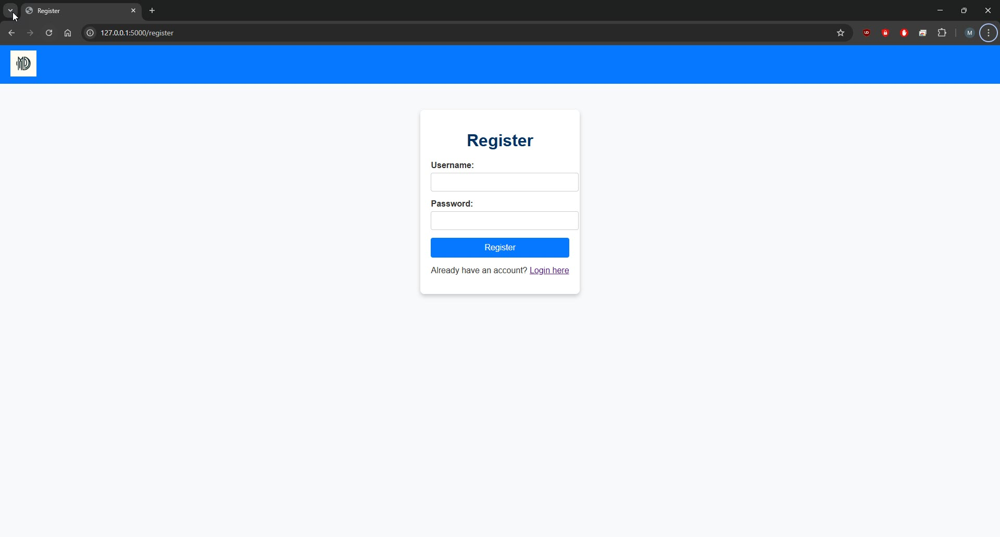
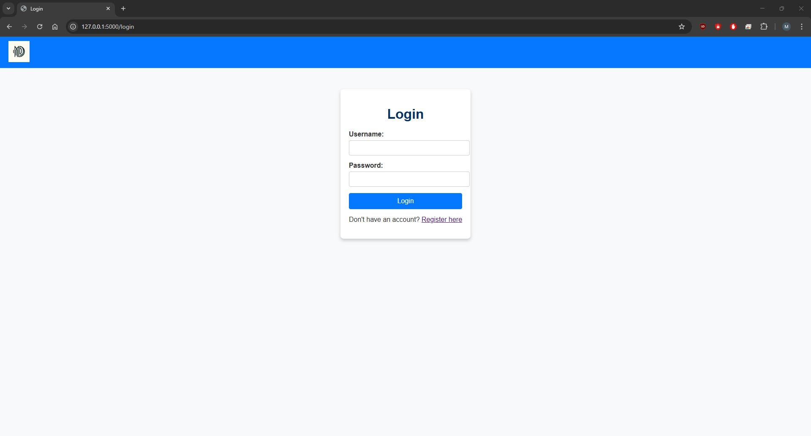
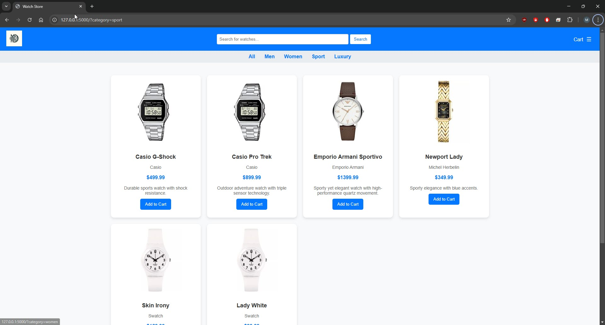
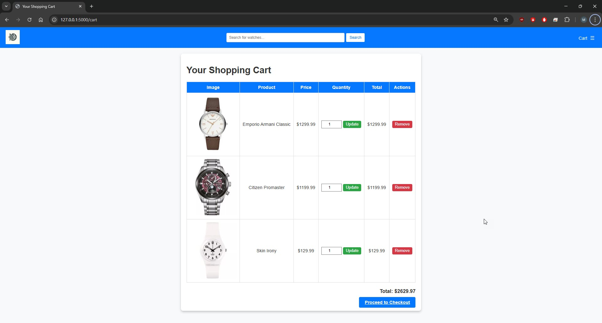
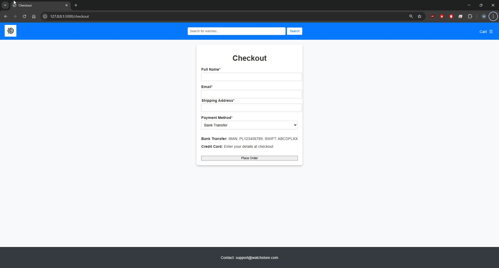
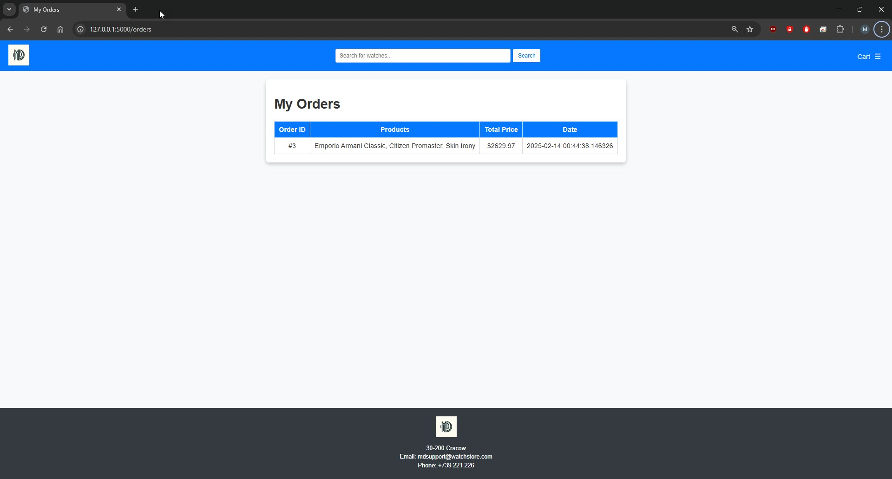
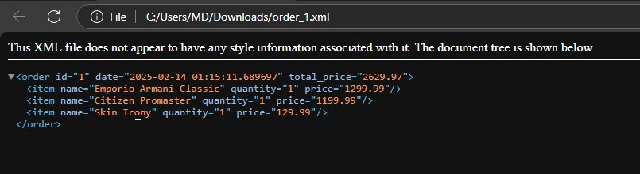
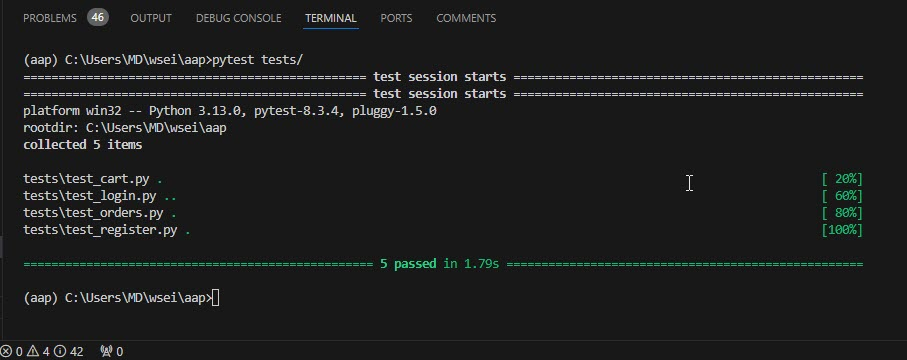

# Product Store E-commerce Application

## Opis aplikacji

Projekt **Product Store** to prosta aplikacja e-commerce umożliwiająca zakup produktów online.  
Pozwala użytkownikom na:

- **Rejestrację i logowanie**
- **Przeglądanie dostępnych zegarków**
- **Przeglądanie zegarków w danych kategoriach**
- **Dodawanie produktów do koszyka**
- **Podgląd koszyka**
- **Finalizowanie zamówień**
- **Przeglądanie historii zamówień**
- **Eksport zamówień w formacie XML**
- **Podgląd listy posiadanych zegarków, na podstawie historii zamówień**

---

## 🛠 Wymagania

Aby uruchomić aplikację, wymagane są:

- **Python w wersji min. 3.x**
- **Flask**
- **SQLAlchemy**
- **pytest** (do testów)
- **SQLite** (domyślna baza danych)

Instalacja zależności:

```sh
pip install -r requirements.txt
```

---

## Uruchamianie aplikacji

1️. **Skonfigurowanie bazy danych**:

```sh
python seed.py
```

2️. **Uruchomienie aplikację**:

```sh
python app.py
```

3️. **Otworzenie wygenerowanego linku, standardowo powinno to być**:

```
http://127.0.0.1:5000/
```

---

## 🤖 Sekcja AI – Inteligentne systemy rekomendacji i ChatBot

Aplikacja **Product Store** została rozszerzona o moduły oparte na sztucznej inteligencji, których celem jest poprawa doświadczenia użytkownika, personalizacja oferty oraz inteligentne wsparcie zakupowe.

W ramach projektu zaimplementowano **trzy główne komponenty AI**:

1. **Systemy rekomendacji produktów**
2. **Mechanizm uczenia online (Multi-Armed Bandit)**
3. **ChatBot – asystent zakupowy (OpenAI GPT-4.1-mini + RAG)**

---

## 🧠 Systemy rekomendacji

Zaimplementowano **dwa niezależne podejścia do rekomendacji**, które mogą działać równolegle lub być łączone.

---

### 🔹 1. Collaborative Filtering (rekomendacje kolaboratywne)

**Opis:**  
System rekomendacji oparty na zachowaniach użytkowników i ich historii zamówień.

**Wykorzystywane dane:**
- historia zakupów użytkowników
- lista posiadanych zegarków
- podobieństwo między użytkownikami

**Jak działa:**
- użytkownicy są porównywani na podstawie zakupionych produktów
- system wyszukuje użytkowników o podobnych preferencjach
- rekomendowane są produkty, które kupili podobni użytkownicy, a których aktualny użytkownik jeszcze nie posiada

**Zalety:**
- dobre wyniki przy większej liczbie użytkowników
- dynamiczne dopasowanie do trendów
- brak potrzeby ręcznego opisywania produktów

**Wady:**
- problem cold start dla nowych użytkowników
- wymaga danych historycznych

---

### 🔹 2. Content-Based Filtering (rekomendacje oparte na treści)

**Opis:**  
System rekomendacji bazujący na cechach produktów oraz preferencjach konkretnego użytkownika.

**Wykorzystywane dane:**
- kategorie zegarków (np. sportowe, klasyczne)
- cechy produktów (styl, przeznaczenie)
- produkty wcześniej przeglądane i kupione przez użytkownika

**Jak działa:**
- system analizuje, jakie produkty użytkownik oglądał lub kupował
- budowany jest profil preferencji użytkownika
- rekomendowane są produkty podobne do tych, które użytkownik już zna

**Zalety:**
- brak problemu cold start po stronie produktów
- pełna personalizacja
- działa nawet dla pojedynczego użytkownika

**Wady:**
- brak odkrywania nowych stylów
- ryzyko monotonnosci rekomendacji

---

## 🎯 Uczenie online – Multi-Armed Bandit

Aby dynamicznie uczyć się, który system rekomendacji działa lepiej, zastosowano algorytm **Multi-Armed Bandit**.

**Jak działa bandit:**
- każdy typ rekomendacji traktowany jest jako ramię automatu
- system losuje wariant rekomendacji dla użytkownika
- obserwowana jest reakcja użytkownika

**Nagrody i kary:**
- ✅ nagroda: kliknięcie, dodanie do koszyka, zakup
- ❌ kara: brak interakcji, szybkie opuszczenie sekcji

Na podstawie tych sygnałów system:
- wzmacnia skuteczniejsze rekomendacje
- ogranicza słabsze warianty
- uczy się w czasie rzeczywistym

---

## 💬 ChatBot – Inteligentny Asystent Zakupowy

W aplikacji zaimplementowano ChatBota opartego na **OpenAI GPT-4.1-mini**.

**Konfiguracja**
Należy dodać zmienną środowiską z kluczen do OpenAI
`setx OPENAI_API_KEY "sk-abc123xyz456..."`

**Funkcje ChatBota:**
- pomoc w wyborze zegarka
- rekomendacje produktów
- obsługa koszyka i zamówień
- wsparcie użytkownika w aplikacji

---

### 🔗 RAG – Retrieval-Augmented Generation

ChatBot wykorzystuje mechanizm **RAG**, dzięki czemu:
- pobiera dane z bazy aplikacji
- korzysta z kontekstu użytkownika
- generuje odpowiedzi oparte na realnych danych

Pozwala to na wykonywanie konkretnych zadań, takich jak:
- rekomendowanie produktów
- sugerowanie alternatyw
- odpowiadanie na pytania o historię zamówień

---

## 🧩 ChatBot jako agent

ChatBot pełni rolę prostego agenta, który:
- interpretuje intencję użytkownika
- wykonuje akcje backendowe
- integruje się z systemami rekomendacji

**Przykładowe polecenia:**
- Poleć sportowy zegarek
- Co pasuje do mojego koszyka?
- Jakie zegarki już kupiłem?

---

## Podsumowanie

W projekcie Product Store zastosowano:
- dwa systemy rekomendacji (collaborative + content-based)
- algorytm banditowy do uczenia skuteczności
- ChatBota AI (GPT-4.1-mini) z mechanizmem RAG
- integrację AI z realnymi danymi aplikacji

System tworzy inteligentne, adaptacyjne środowisko e-commerce, które personalizuje ofertę i wspiera użytkownika w procesie zakupowym.

## Dokumentacja zdjęciowa

Aby lepiej zrozumieć działanie aplikacji, poniżej znajdują się zrzuty ekranu przedstawiające jej kluczowe funkcjonalności.

### **Rejestracja**



### **Logowanie**



### **Strona główna**


### **ChatBot - Asystent**


### **Rekomendacje - AI**


### **Strona główna**


### **Filtrowanie po kategorii produktow**



### **Koszyk użytkownika**



### **Checkout**



### **Historia zamówień**



### **Eksport zamówienia do XML**




---

## Testowanie aplikacji

Aby uruchomić testy jednostkowe, skorzystaj z poniższego polecenia:

```sh
pytest tests/
```



---

## Struktura projektu

```
aap/
│-- app.py                   # Główna aplikacja Flask
│-- models.py                # Modele SQLAlchemy
│-- routes/
│   ├── routes.py            # Home page
│   ├── auth_routes.py       # Logowanie i rejestracja
│   ├── cart_routes.py       # Obsługa koszyka
│   ├── orders_routes.py     # Historia zamówień
│   ├── checkout_routes.py   # Finalizacja zamówienia
│   ├── my_watches_routes.py # Kupione zegarki
│-- static/
│   ├── styles.css           # Plik stylów
│-- templates/
│   ├── index.html           # Strona główna
│   ├── cart.html            # Koszyk
│   ├── checkout.html        # Finalizacja zamówienia
│   ├── orders.html          # Historia zamówień
│   ├── my_watches.html      # Kupione zegarki
│-- tests/
│   ├── test_cart.py         # Testy koszyka
│   ├── test_login.py        # Testy logowania
│   ├── test_orders.py       # Testy zamówień
│   ├── test_register.py     # Testy rejestracji
│-- requirements.txt         # Lista zależności
│-- README.md                # Dokumentacja
│-- seed.py                  # Skrypt inicjalizujący seedy do bazy danych
```

---

## Endpointy API

| Endpoint                   | Metoda | Opis                         |
| -------------------------- | ------ | ---------------------------- |
| `/`                        | GET    | Strona główna                |
| `/login`                   | POST   | Logowanie użytkownika        |
| `/register`                | POST   | Rejestracja użytkownika      |
| `/cart`                    | GET    | Podgląd koszyka              |
| `/cart/add/<id>`           | POST   | Dodanie produktu do koszyka  |
| `/cart/remove/<id>`        | POST   | Usunięcie produktu z koszyka |
| `/orders`                  | GET    | Historia zamówień            |
| `/orders/<id>/xml`         | GET    | Pobranie zamówienia jako XML |
| `/api/chat`                | POST   | Wysyła wiadomość do AI       |
| `/api/track-click`         | POST   | Rejestruje kliknięcie        |
| `/api/recommendations-html`| GET    | Generuje rekomendacji (AI)   |

---

